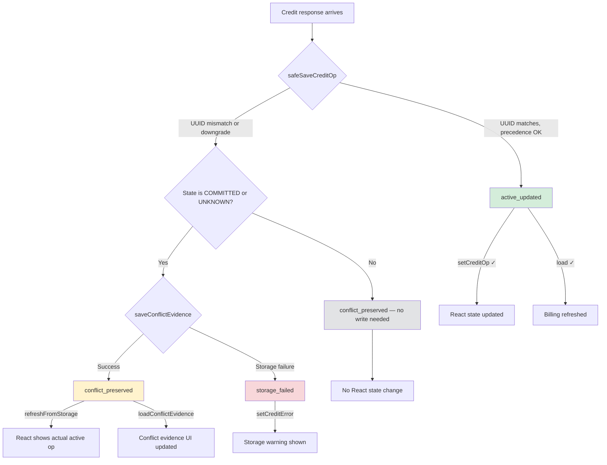
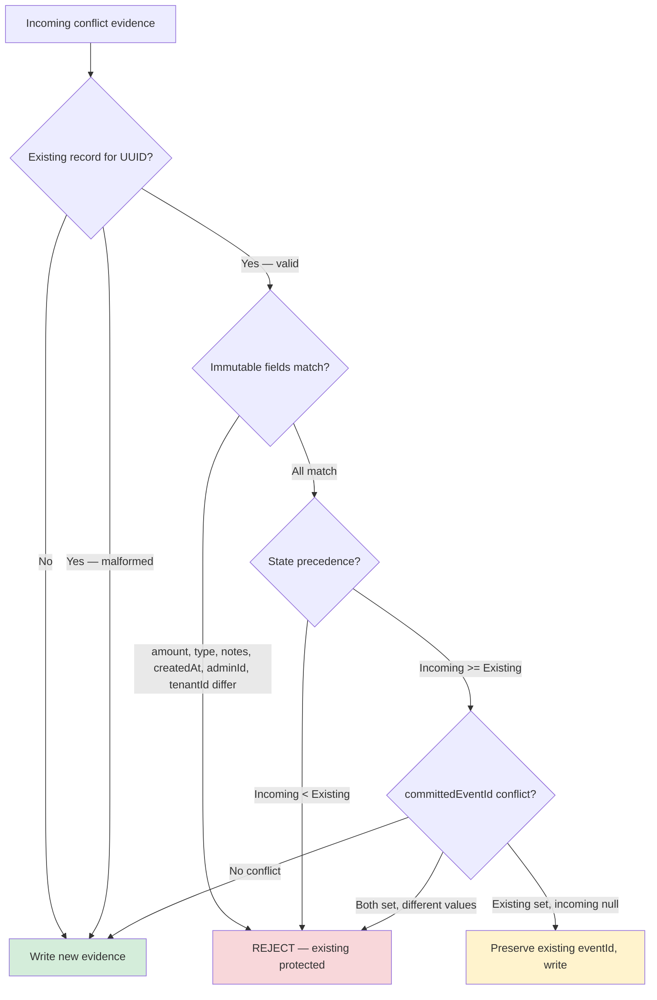
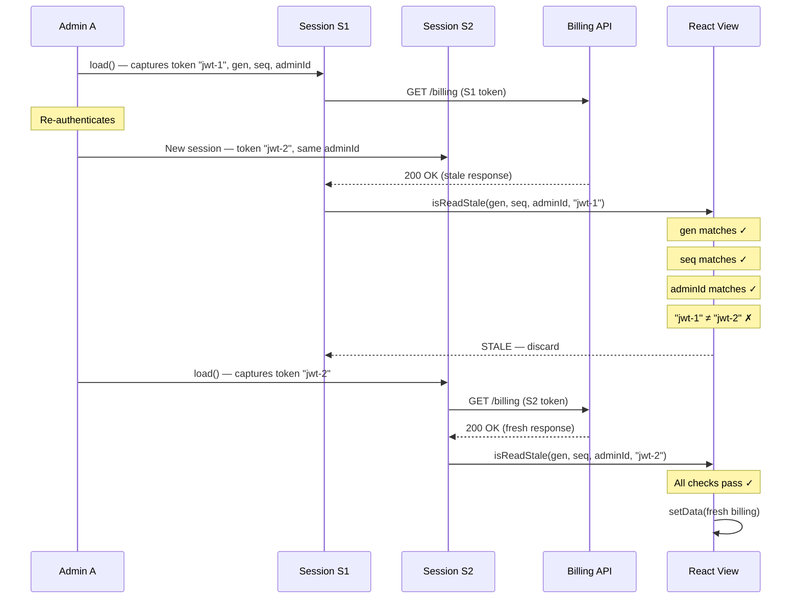

# Phase 5.3.6 — Mermaid Diagrams

## Diagram A — Active vs Conflict Persistence

```mermaid
flowchart TD
    A[Credit response arrives] --> B{safeSaveCreditOp}
    B -->|UUID matches, precedence OK| C[active_updated]
    B -->|UUID mismatch or downgrade| D{State is COMMITTED or UNKNOWN?}
    D -->|Yes| E{saveConflictEvidence}
    D -->|No| F[conflict_preserved — no write needed]
    E -->|Success| G[conflict_preserved]
    E -->|Storage failure| H[storage_failed]

    C -->|setCreditOp ✓| I[React state updated]
    C -->|load ✓| J[Billing refreshed]
    G -->|refreshFromStorage| K[React shows actual active op]
    G -->|loadConflictEvidence| L[Conflict evidence UI updated]
    F --> M[No React state change]
    H -->|setCreditError| N[Storage warning shown]

    style C fill:#d4edda
    style G fill:#fff3cd
    style H fill:#f8d7da
    style F fill:#e2e3e5
```

## Diagram B — Financial Identity Validation

```mermaid
flowchart TD
    A[Incoming conflict evidence] --> B{Existing record for UUID?}
    B -->|No| C[Write new evidence]
    B -->|Yes — malformed| C
    B -->|Yes — valid| D{Immutable fields match?}

    D -->|amount, type, notes, createdAt, adminId, tenantId differ| E[REJECT — existing protected]
    D -->|All match| F{State precedence?}

    F -->|Incoming < Existing| E
    F -->|Incoming >= Existing| G{committedEventId conflict?}

    G -->|Both set, different values| E
    G -->|Existing set, incoming null| H[Preserve existing eventId, write]
    G -->|No conflict| C

    style E fill:#f8d7da
    style C fill:#d4edda
    style H fill:#fff3cd
```

## Diagram C — Session Freshness for Reads

```mermaid
sequenceDiagram
    participant Admin as Admin A
    participant S1 as Session S1
    participant S2 as Session S2
    participant API as Billing API
    participant View as React View

    Admin->>S1: load() — captures token "jwt-1", gen, seq, adminId
    S1->>API: GET /billing (S1 token)

    Note over Admin: Re-authenticates
    Admin->>S2: New session — token "jwt-2", same adminId

    API-->>S1: 200 OK (stale response)

    S1->>View: isReadStale(gen, seq, adminId, "jwt-1")
    Note over View: gen matches ✓
    Note over View: seq matches ✓
    Note over View: adminId matches ✓
    Note over View: "jwt-1" ≠ "jwt-2" ✗
    View-->>S1: STALE — discard

    Admin->>S2: load() — captures token "jwt-2"
    S2->>API: GET /billing (S2 token)
    API-->>S2: 200 OK (fresh response)
    S2->>View: isReadStale(gen, seq, adminId, "jwt-2")
    Note over View: All checks pass ✓
    View->>View: setData(fresh billing)
```
