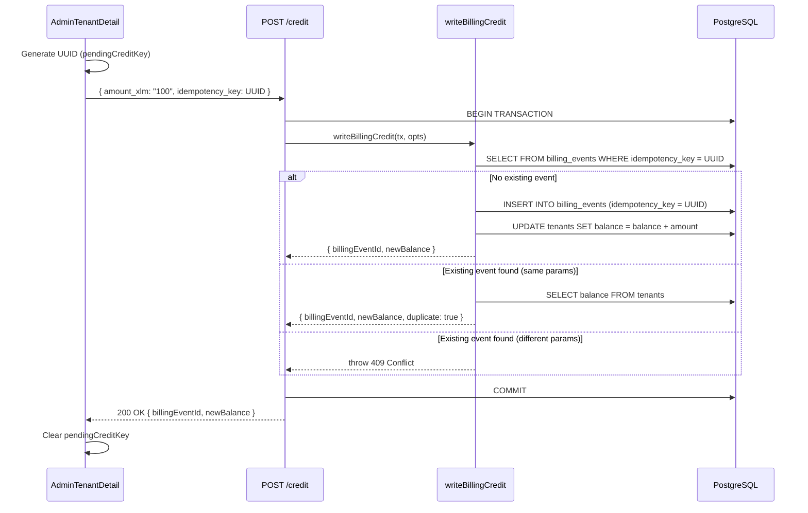

# Idempotency Flow — Credit Posting

```mermaid
sequenceDiagram
    participant UI as AdminTenantDetail
    participant API as POST /credit
    participant SVC as writeBillingCredit
    participant DB as PostgreSQL

    UI->>UI: Generate UUID (pendingCreditKey)
    UI->>API: { amount_xlm: "100", idempotency_key: UUID }
    API->>DB: BEGIN TRANSACTION
    API->>SVC: writeBillingCredit(tx, opts)
    SVC->>DB: SELECT FROM billing_events WHERE idempotency_key = UUID
    alt No existing event
        SVC->>DB: INSERT INTO billing_events (idempotency_key = UUID)
        SVC->>DB: UPDATE tenants SET balance = balance + amount
        SVC-->>API: { billingEventId, newBalance }
    else Existing event found (same params)
        SVC->>DB: SELECT balance FROM tenants
        SVC-->>API: { billingEventId, newBalance, duplicate: true }
    else Existing event found (different params)
        SVC-->>API: throw 409 Conflict
    end
    API->>DB: COMMIT
    API-->>UI: 200 OK { billingEventId, newBalance }
    UI->>UI: Clear pendingCreditKey
```
