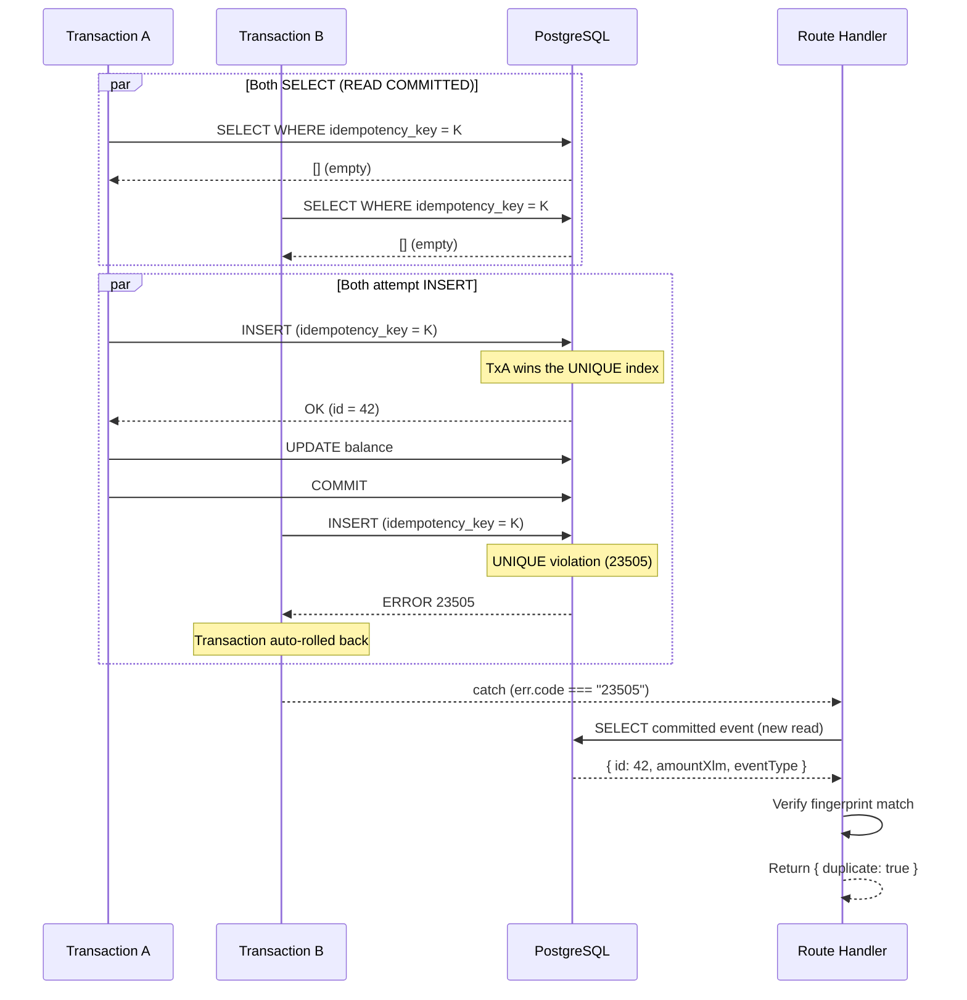

# Concurrent Idempotency Race — Two Transactions

```mermaid
sequenceDiagram
    participant TxA as Transaction A
    participant TxB as Transaction B
    participant DB as PostgreSQL
    participant Handler as Route Handler

    par Both SELECT (READ COMMITTED)
        TxA->>DB: SELECT WHERE idempotency_key = K
        DB-->>TxA: [] (empty)
        TxB->>DB: SELECT WHERE idempotency_key = K
        DB-->>TxB: [] (empty)
    end

    par Both attempt INSERT
        TxA->>DB: INSERT (idempotency_key = K)
        Note over DB: TxA wins the UNIQUE index
        DB-->>TxA: OK (id = 42)
        TxA->>DB: UPDATE balance
        TxA->>DB: COMMIT

        TxB->>DB: INSERT (idempotency_key = K)
        Note over DB: UNIQUE violation (23505)
        DB-->>TxB: ERROR 23505
        Note over TxB: Transaction auto-rolled back
    end

    TxB-->>Handler: catch (err.code === "23505")
    Handler->>DB: SELECT committed event (new read)
    DB-->>Handler: { id: 42, amountXlm, eventType }
    Handler->>Handler: Verify fingerprint match
    Handler-->>Handler: Return { duplicate: true }
```
