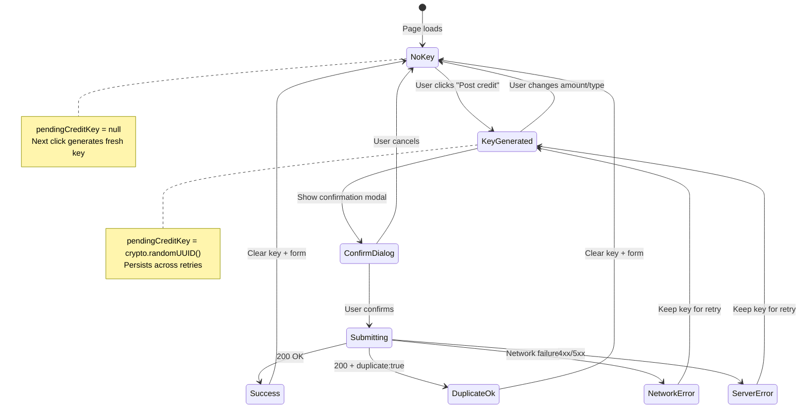

# Frontend Idempotency Key Lifecycle

```mermaid
stateDiagram-v2
    [*] --> NoKey: Page loads
    NoKey --> KeyGenerated: User clicks "Post credit"
    KeyGenerated --> ConfirmDialog: Show confirmation modal

    ConfirmDialog --> Submitting: User confirms
    ConfirmDialog --> NoKey: User cancels

    Submitting --> Success: 200 OK
    Submitting --> DuplicateOk: 200 + duplicate:true
    Submitting --> NetworkError: Network failure
    Submitting --> ServerError: 4xx/5xx

    Success --> NoKey: Clear key + form
    DuplicateOk --> NoKey: Clear key + form
    NetworkError --> KeyGenerated: Keep key for retry
    ServerError --> KeyGenerated: Keep key for retry

    KeyGenerated --> NoKey: User changes amount/type

    note right of KeyGenerated
        pendingCreditKey = crypto.randomUUID()
        Persists across retries
    end note

    note right of NoKey
        pendingCreditKey = null
        Next click generates fresh key
    end note
```
