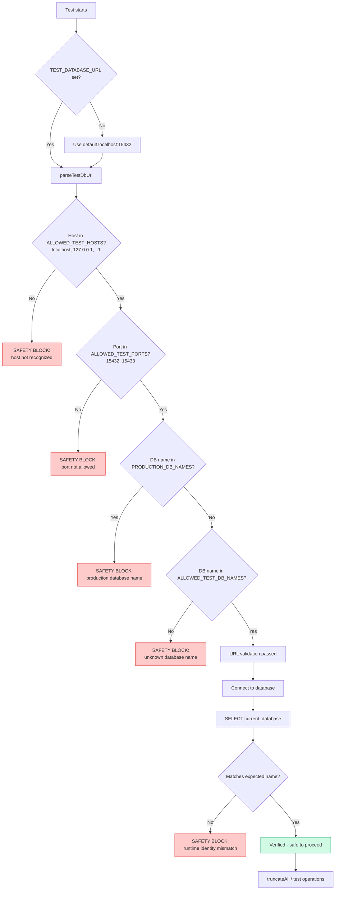

# Integration Test Database Safety Guards

```mermaid
flowchart TD
    A[Test starts] --> B{TEST_DATABASE_URL set?}
    B -->|Yes| C[parseTestDbUrl]
    B -->|No| C2[Use default localhost:15432]
    C2 --> C

    C --> D{Host in ALLOWED_TEST_HOSTS?<br/>localhost, 127.0.0.1, ::1}
    D -->|No| BLOCK1[SAFETY BLOCK:<br/>host not recognized]
    D -->|Yes| E{Port in ALLOWED_TEST_PORTS?<br/>15432, 15433}
    E -->|No| BLOCK2[SAFETY BLOCK:<br/>port not allowed]
    E -->|Yes| F{DB name in PRODUCTION_DB_NAMES?}
    F -->|Yes| BLOCK3[SAFETY BLOCK:<br/>production database name]
    F -->|No| G{DB name in ALLOWED_TEST_DB_NAMES?}
    G -->|No| BLOCK4[SAFETY BLOCK:<br/>unknown database name]
    G -->|Yes| H[URL validation passed]

    H --> I[Connect to database]
    I --> J[SELECT current_database]
    J --> K{Matches expected name?}
    K -->|No| BLOCK5[SAFETY BLOCK:<br/>runtime identity mismatch]
    K -->|Yes| L[Verified - safe to proceed]
    L --> M[truncateAll / test operations]

    style BLOCK1 fill:#fecaca,stroke:#dc2626
    style BLOCK2 fill:#fecaca,stroke:#dc2626
    style BLOCK3 fill:#fecaca,stroke:#dc2626
    style BLOCK4 fill:#fecaca,stroke:#dc2626
    style BLOCK5 fill:#fecaca,stroke:#dc2626
    style L fill:#d1fae5,stroke:#059669
```
